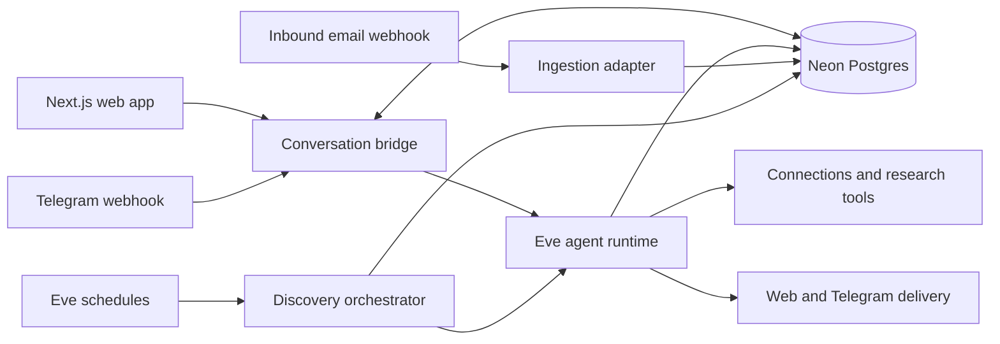

# Gravy Scout target architecture

Status: proposed foundation for the multi-member product.

## Product boundary

Gravy Scout is a personalized opportunity-intelligence agent. It learns a member's career profile, continuously collects evidence, and recommends:

1. advertised roles,
2. likely roles implied by company expansion or hiring signals, and
3. unexpected roles or companies with unusually strong member fit.

The product is not a job-board scraper, an auto-application bot, or an autonomous outreach bot. Every recommendation must explain why it fits and cite current evidence.

## Architecture principles

1. **One member, one canonical conversation.** Web and Telegram render the same product-level message timeline.
2. **Eve owns agent execution, not product data.** Eve sessions, channels, tools, skills, schedules, subagents, and evals remain the agent runtime. Postgres owns members, conversations, evidence, preferences, and opportunities.
3. **Structured state is authoritative.** Markdown memory may be generated as context, but never acts as the source of truth.
4. **Evidence before synthesis.** Source items are immutable; signals cite source items; opportunities cite signals.
5. **Deterministic pipeline, agentic judgment.** Code handles ingestion, idempotency, normalization, state transitions, and thresholds. Models classify, research, explain, and draft.
6. **Least privilege by default.** Prefer forwarding job alerts to a member-specific inbox over requesting broad mailbox access. Store provider tokens only through managed OAuth infrastructure.
7. **Human approval for external actions.** Gravy Scout may draft outreach but must not send, post, apply, or message without explicit approval.

## Runtime view

## Selected stack

| Concern | Choice | Reason |
| --- | --- | --- |
| Web | Next.js App Router on Vercel | Already in place and integrates with Eve through `withEve` |
| UI | shadcn/ui + Tailwind | Owned, accessible primitives and consistent agent-friendly composition |
| Agent | Eve | Durable sessions, channels, tools, skills, schedules, subagents, and evals are the learning goal and fit the workload |
| Primary data | Neon Postgres + Drizzle | Relational model, migrations, serverless driver, full-text search, future `pgvector`, and Vercel Marketplace provisioning |
| Authentication | Clerk | Managed multi-member auth with a stable subject for web requests; no home-grown identity system |
| Telegram | Eve Telegram channel | Native webhook verification, delivery, attachments, and human-in-the-loop support |
| Email alerts | Member-specific inbound address through a transactional email provider | Captures LinkedIn/Seek/Indeed alerts without broad Gmail permissions |
| Optional mailbox access | Vercel Connect generic OAuth or a dedicated mailbox integration | Added only after forwarding proves insufficient; scoped and revocable |
| Short-lived coordination | Upstash Redis, only when needed | Locks, webhook dedupe, and rate limits; not product state |
| Files | Vercel Blob | Résumés and member-uploaded documents |
| Models | Vercel AI Gateway | Unified routing, observability, and provider changes without rewriting agent code |

Neon is preferred over the current SQLite/libSQL design because the target is multi-member and relational. Supabase would also work, but its bundled auth/realtime features duplicate chosen concerns. Convex would make reactive UI easy but creates a second server-function model beside Eve. PlanetScale is a weaker fit for evidence joins and vector/full-text features.

## Bounded modules and seams

### Identity module

Small interface:

- resolve the authenticated web principal to a member,
- resolve a Telegram user ID to a member,
- create and consume one-time channel-link tokens,
- revoke a channel identity.

Only this module knows provider IDs. Agent tools receive the internal `memberId`.

### Career profile module

Small interface:

- read a context snapshot,
- apply explicit profile changes,
- append inferred preferences with provenance,
- record feedback.

It hides normalization, precedence, provenance, and audit history. Explicit member choices always outrank inferred preferences.

### Conversation module

Small interface:

- append an idempotent message,
- list a conversation from a cursor,
- associate a surface-specific Eve session,
- subscribe the web client to changes.

The conversation is canonical; Eve session event streams remain available for live execution and observability but are not the long-term chat database.

### Ingestion module

Every source adapter emits the same `SourceItemInput` contract. Initial adapters:

1. inbound job-alert email,
2. public web/news search,
3. company careers pages or feeds,
4. optional X data source,
5. manual URL or forwarded message.

Adapters do not score opportunities. They verify origin, normalize metadata, hash content, and insert idempotently.

### Intelligence module

Transforms source items into signals and company dossier updates. Expensive research is delegated to Eve subagents with source and tool limits. Every stored claim includes citations and observed time.

Suggested Eve subagents:

- `job_alert_analyst` — extracts roles, locations, compensation, and canonical links.
- `company_researcher` — verifies expansion, funding, filings, leadership, and hiring evidence.
- `fit_analyst` — compares one candidate role with one career profile and returns structured rationale.

### Opportunity module

Combines deterministic eligibility and scoring with model-produced rationale. It owns opportunity state transitions and notification cooldowns. Scoring inputs and versions are stored so recommendations are explainable and reproducible.

### Discovery orchestrator

An Eve schedule calls deterministic TypeScript orchestration:

1. claim a run idempotently,
2. process unhandled source items,
3. derive and verify signals,
4. refresh affected dossiers,
5. generate member-specific candidates,
6. score and upsert opportunities,
7. create a digest only for material changes,
8. deliver through each consenting channel,
9. persist run outcomes.

The model does not decide whether database work succeeded or which rows are processed.

## Conversation synchronization

Eve continuation tokens are channel-local, so a web Eve session and Telegram Eve session must not be presented as one runtime session. The product instead synchronizes at the canonical conversation seam:

1. inbound web or Telegram message is stored with an idempotency key;
2. the conversation bridge sends it into that surface's Eve session;
3. relevant shared conversation history and career-profile context are provided to the agent;
4. completed assistant messages are stored once;
5. Telegram receives the message and the web app observes the same row.

This gives members one visible history while respecting Eve's channel ownership model. Session summaries prevent every channel switch from replaying an unbounded transcript.

## Initial data model

Core tables:

- `members`
- `channel_identities`
- `connections`
- `career_profiles`
- `preferences`
- `feedback_events`
- `conversations`
- `messages`
- `agent_sessions`
- `source_items`
- `source_item_receipts`
- `companies`
- `company_aliases`
- `signals`
- `signal_sources`
- `company_dossiers`
- `candidate_roles`
- `opportunities`
- `opportunity_evidence`
- `discovery_runs`
- `digest_deliveries`

Every member-owned table includes `member_id`. Shared company intelligence does not. Secrets and OAuth tokens are never stored in these tables.

## Security and privacy

- Remove anonymous production access from the Eve HTTP channel.
- Authorize every conversation and member-data query server-side.
- Link Telegram with a short-lived, single-use token generated by an authenticated member; never link by username.
- Verify Telegram and inbound email webhook signatures before parsing.
- Store minimal email excerpts needed for evidence. Default retention for full inbound bodies should be short and configurable.
- Treat career and communication data as sensitive. Do not expose chain-of-thought or raw reasoning events.
- Log model/tool metadata and citations, not provider secrets or full private documents.
- Add per-member export and deletion before public launch.

## UI information architecture

The web product should use shadcn primitives and four primary surfaces:

1. **Today** — concise digest, top opportunities, and pending questions.
2. **Opportunities** — ranked list with filters, evidence, fit rationale, and disposition controls.
3. **Conversation** — the synchronized Gravy Scout chat.
4. **Profile & connections** — career profile, preferences, inbound alert address, Telegram status, and privacy controls.

Onboarding should progressively collect only what is required:

1. account,
2. career snapshot or résumé,
3. goals and constraints,
4. inbound job-alert address instructions,
5. optional Telegram link,
6. first evidence-backed recommendations.

Mobbin research is intentionally pending because no Mobbin MCP server is available in the current environment. UI implementation must not claim Mobbin-derived patterns until that server is connected and the source flows are recorded.

## Observability and evaluation

- Use Eve Agent Runs for runtime traces.
- Add deterministic Eve evals for tool choice, memory updates, citation requirements, channel-link safety, and no-op digests.
- Add fixture-driven integration tests across inbound email → source item → signal → opportunity → digest.
- Track precision-oriented product outcomes: save rate, pursue rate, dismiss reason, duplicate rate, stale-link rate, and notification opt-out rate.
- Never optimize only for number of opportunities or message engagement.
